# Tôi đã "cào" data sinh viên trường *Z* như thế nào?

> [!NOTE]
> Vấn đề đã được báo cáo và sửa chữa, phần thưởng cho phát hiện này là một trầu `Trà đá kem cheese` 🍻
> Kiến thức về web tôi còn hạn hẹp, nếu có gì sai sót trong bài mong mọi người bỏ qua!

Trường tôi có cả tá, cả rổ ứng dụng về tra cứu lịch học lịch thi như (Còn nhiều mà chưa dùng hết 😅):

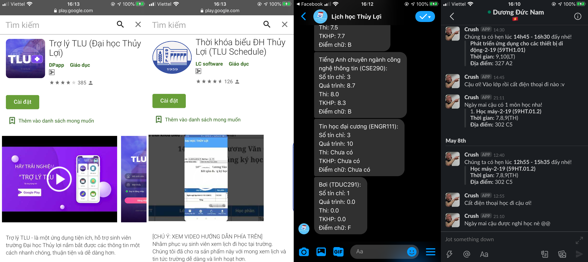

Vì vậy, một bạn sinh viên trường **Z** đã nhờ tôi ngâm cứu một cái dùng cho trường **Z** 😃. Sau một hồi lượn lờ quanh site `Z.edu.vn` của sinh viên tôi phát hiện ra một site khá là hay ho `Z1.edu.vn` lưu trữ ảnh thẻ của sinh viên với dạng như sau:

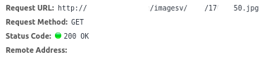

Sau một hồi ngâm cứu thì tôi phát hiện ra mã 17xxxx50 chính là mã dự thi THPTQG của sinh viên. Sau đó tôi tiếp tục truy cập thử trang web `Z1.edu.vn` để xem mặt mũi nó ra làm sao thì ối dời ơi nó lại là màn hình đăng nhập giống như `Z.edu.vn`... login in thử cái nào, và đã vào được dashboard trắng trơn với dòng thông báo `bạn không có quyền thực hiện thao tác này!` 😶

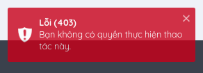

Hiu hiu cứ tưởng đến đây là cuộc dạo chơi chấm dứt, nhưng không đã chót lạc lối thì về sớm như vậy thì quá là sớm. Ngâm cứu dạo thì đó chỉ là màn xử lý role nằm ở client thôi hehe 😃. "Up role" cái nào...

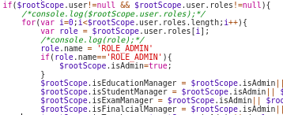

Và đây chính là giao diện site đào tạo trường **Z**

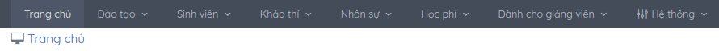

Sau một hồi đào bới thì cái không nên thấy thì tôi đã thấy **"Bị cấm thi"**, một từ khóa tôi đang ám ảnh trong kỳ này 😞

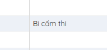

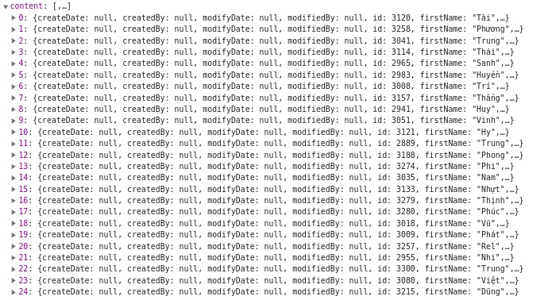

Tiếp tục đi đến phần quản lý đào tạo...

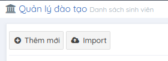

Data của 13428 sinh viên, wtf 😮

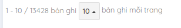

nhưng mà có một điều khá hay ho là khi tôi chọn sang trang 2 thì lại không get được gì, tưởng chừng như phải đi chỗ khác chơi thì bỗng dưng tôi nhìn thấy...

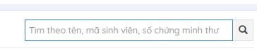

Nhập thử số 1..., quào tất cả dữ liệu của 13428 sinh viên đã về tay tôi =)), dữ liệu bao gồm cả stk ngân hàng, họ tên, ngày sinh, quê quán, số cmnd, sđt, link fb, email, thông tin bố mẹ,... không thể ngờ được là những thông tin như thế này lại có thể get ra dễ dàng như vậy.

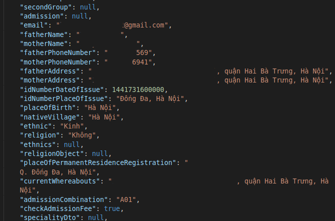

Chợt tôi nhìn thấy trường `candidateCode`, đó chính là mã dự thi THPTQG => quay lại ban đầu thì tôi đã crawl được gần 3k ảnh thẻ sinh viên =))

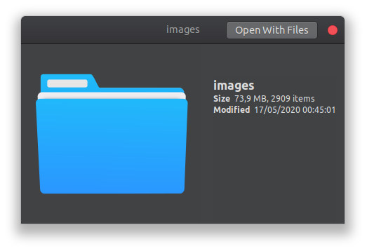

Sau vài ngày ngâm cứu thì tôi phát hiện ra được khá nhiều thứ hay ho (Có vẻ ho hơi nhiều nhưng không phải covid đâu 😃) như: Điểm thi của sinh viên theo môn học, thông tin thí sinh trúng tuyển vào trường khá đầy đủ (đầy đủ đến mức có cả ngày kết nạp đoàn :v), password được băm bằng bcypt nhưng lại set mặc định là trường idNumber nằm trong dữ liệu tôi đã lấy được (Được mấy ông đổi pass mặc định này 🙂), get toàn bộ thông tin thí sinh trong một phòng thi, list mail được generate cho sinh viên, một số hàm post có thể sử dụng dưới role sinh viên (Tiếc là tôi quên chưa chụp chỗ này) =))

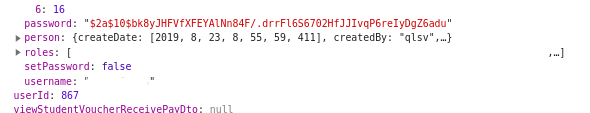
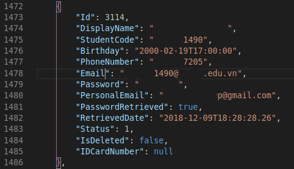

Tổng kết lại tôi đã lấy được 1gb data, bao gồm:

- Thông tin của 13000 sinh viên.
- Ảnh thẻ của 3000 sinh viên.
- Điểm sinh viên theo môn học.
- Danh sách thí sinh trúng tuyển vào trường (Đã nhập học hoặc chưa).
- Mật khẩu mail mặc định của sinh viên.

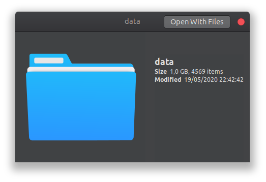

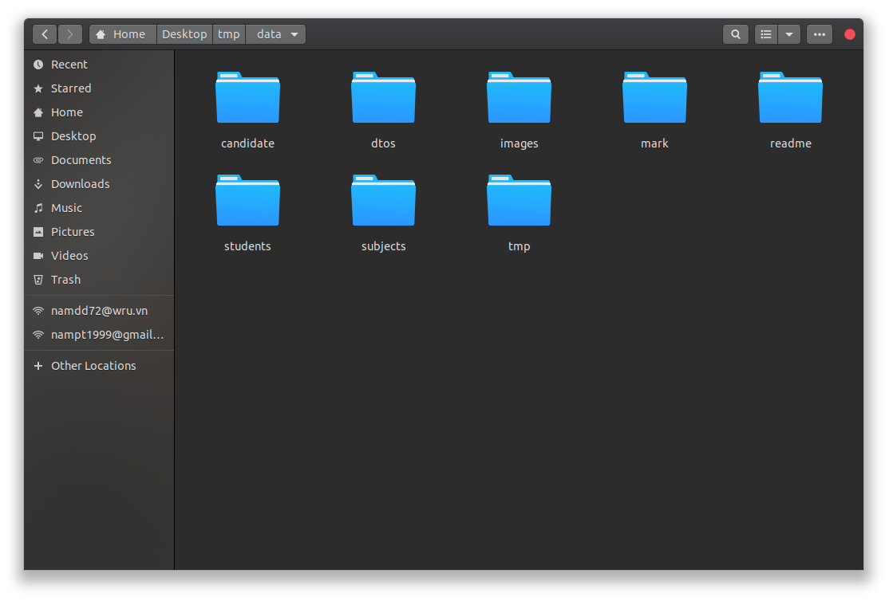

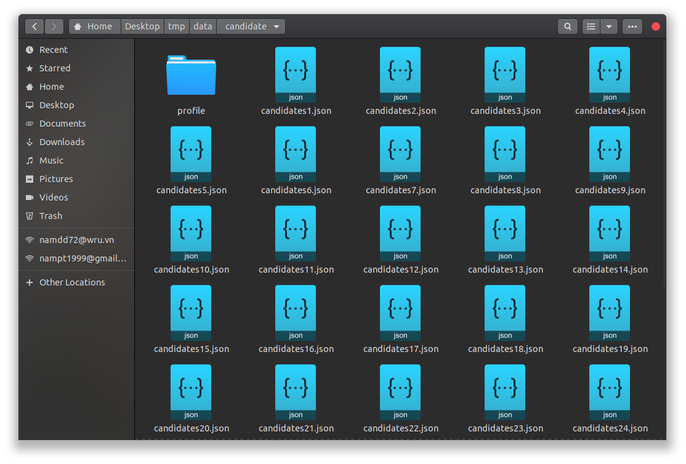

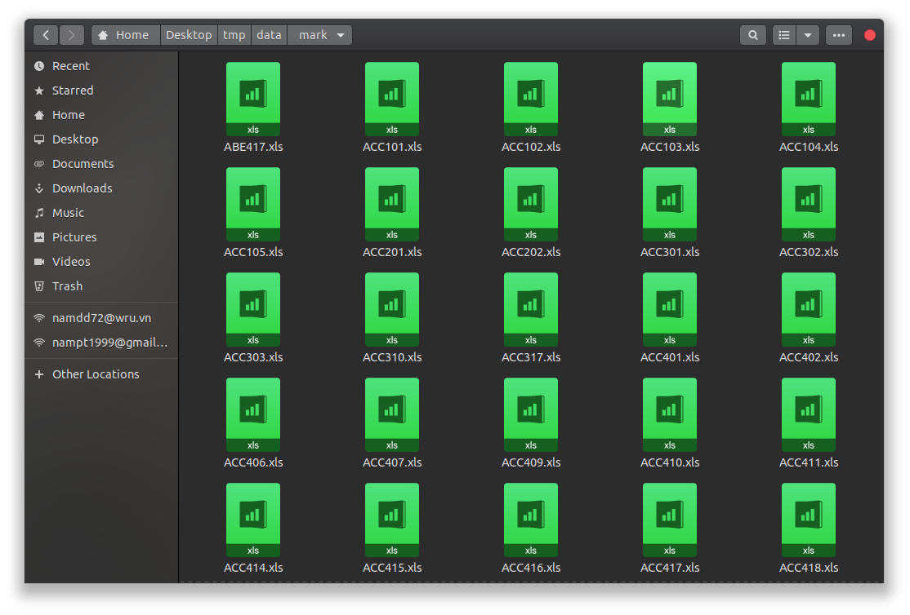

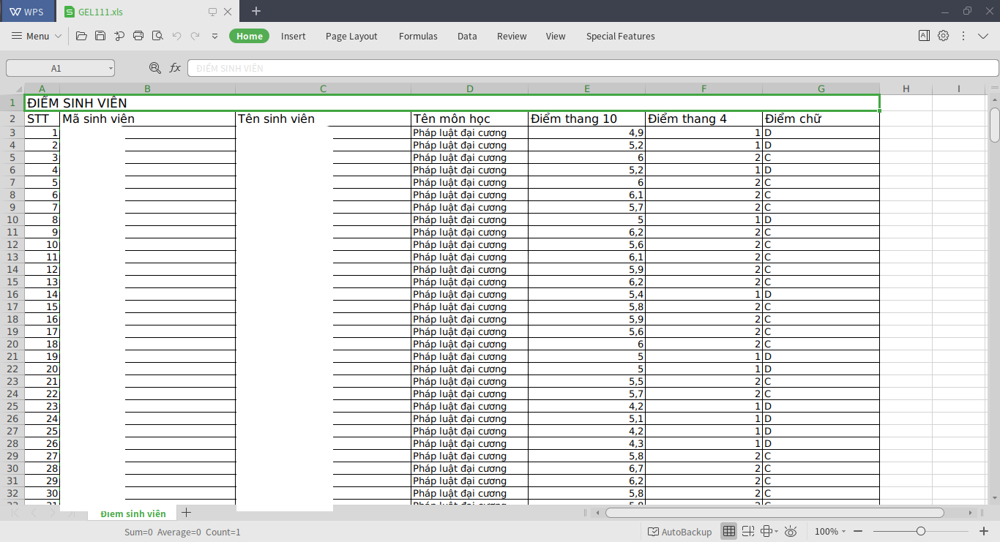

Làm được những gì:
- Truy cập được phần lớn các account sinh viên do pass mặc định.
- Đối với thông tin thẻ ngân hàng (nếu làm gì thì mọi người biết sẽ làm được những gì rồi đó).
- Post dạo một số data lên.

> Bài học được rút ra: error = (more code)^2

